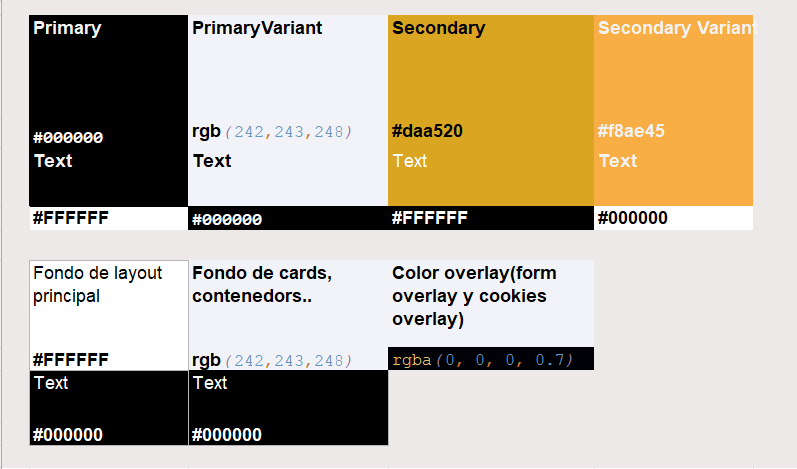
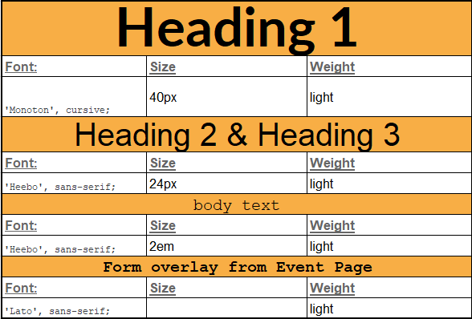

<h1>TimeInn</h1>

## Tabla de contenidos:
---
- [Cambios_P3](#Cambios-en-P3)
- [Descripción y contexto](#descripción-y-contexto)
- [Guía de usuario](#guía-de-usuario)
- [Dificultades del proyecto](#Dificultades-del-proyecto)
- [Mejoras del proyecto](#Mejoras-proyecto)
- [Wireframe](#WireFrame)
- [color_font_pallete](#Color-and-font-pallete)  
- [Paginas_web_inspiradas](#Paginas-web-inspiradas)
- [Video](#Video)
- [Netlify](#Netlify)
- [Autor/es](#autores)

#Cambios en P3 + Pc3 FORMULARIOS:
---
<h2> Formulario idea general:</h2>
Nuestro formulario se accede a través del index con el botón iniciar sesión que está arriba a la derecha de TimeInn. Una vez dentro de iniciar sesión
se encontrará con login (login.html) en el que el usuario pondrá su usuario y contraseña o podrá optar por registrarse (signup.html).
En nuestro caso y como forma de ampliación hemos utilizado **LOCALSTORAGE**  por lo que el usuario deberá primero registrarse y si no existe el email o el nombre
aparecerá en la pantalla de login. El usuario en esa pantalla podrá poner el nombre de usuario o email y la contraseña que anteriormente en el sign-up
habrá puesto. Gracias a Localstorage almacenamos los usuarios ya creados y comprobará si existe o no, por lo que está sería nuestra tabla de usuarios.
Para poder ver la tabla de localstorage hemos utilizado la extensión de chrome:
https://chrome.google.com/webstore/detail/local-storage-explorer/hglfomidogadbhelcfomenpieffpfaeb/related

- En el documento de js script.js tenemos la función de visualización para visualizar la contraseña o no. Nosotros hemos optado a que con un click 
  aparezca y se muestre la contraseña y al volver a pulsar click no se muestre basandonos en google que realiza la misma funcionalidad.
- En el documento de validation.mjs tenemos todas las funciones de comprobar el email, nombre y contraseña cuando se registra el usuario.
- En el documento de validationLogin.js en Login comprobamos que existe o no el usuario introducido. Si existe te redirige a index.html
- En el documento de validationSignup.js creamos el usuario si todas las validaciones de signup están correctas o no. Si existe te redirige a login.html
- En el documento de projects.js modificamos la cookie para que mostrase el nombre de usuario o email en el index.html.

<h3> Tests </h3>
Creado tests en la carpeta tests. Son dos describe y 3 its.
---
<h3> Validaciones </h3>
En nuestro formulario hemos añadido:
- mensajes del login incorrecto:
  Saldrá un mensaje de error en el formulario de color rojo en cuanto el usuario salga de encima del input con el ratón.
  Utilizamos expresiones regulares en password para validar que sea correcto.
    - Validar el nombre, hemos tenido en cuenta lo siguiente:
      - no puede estar vacío (saldrá un mensaje de que el número de caracteres debe ser entre 3 y 20)
      - numero de caracteres entre 3 y 20
    - Validar el email, hemos tenido en cuenta los siguientes patrones:
      - valida al salir del campo (al perder el foco)
      - no puede estar vacío
      - no debe existir en la Tabla de Usuarios
        - Patron de validacion:
          Nombre@nombreorganizacion.tipo
        - nombre: solo la primera letra en mayúscula y el resto en minúscula
        - nombre de la organización: entre 5 y 10 minusculas
        - tipo: Solo pueden ser com, net o gov.
        - Solo puede haber una @ y un punto.
    - Validar la contraseña, hemos tenido en cuenta los siguientes patrones:  
      - valida al salir del campo (al perder el foco)
      - Muestra mensajes debajo de los campos para los errores que puedan suceder.
      - Patron de validacion:
        - Longitud mínima de siete caracteres
        - Incluir letras mayúsculas y minúsculas
        - Incluir números
        - Incluir caracteres espespeciales (por ejemplo, !, $, %, &, etc.)
      
## Descripción y contexto
---
Está es una página de consulta de noticias y eventos de música. Tenemos eventos destacados y noticias patrocinadas. Hay una segunda página que nos permite
crear, editar, filtrar y borrar eventos.

## Guía de usuario
---
**Funcionalidades:**

<h3>El Front page contiene: (index.html && project.js && renderfront.js) </h3>
- Header:
  Nuestro header contiene un buscador que es fake.
  
- Un menú de navegación, mínimo de 4 secciones. El menu de navegación es fake.
- Un vídeo cuya actuación se reproduce al entrar en la página
- Unas cards de news con título, descripción, fecha de publicación y foto. Se mostrarán primero las noticias patrocinadas y después las más recientes.
- Unas cards de 3 eventos con título, foto, lugar donde se celebra, fecha y hora. Se mostrarán los eventos que estén más cercanos en el tiempo, primero los que lleguen antes.
- Un calendario de un mes. Pulsando en el día 1 accedemos a Pantalla con listado de eventos”
- Footer:
  Los enlaces que hay en el footer no llevan a ningún lugar es "fake"!.
- Cookie:
  Si no hay cookies, saltará un Formulario de suscripción al iniciar la página.
  Se guarda en una Cookie si el formulario de suscripción se ha mostrado al usuario, para que no se le muestre dos veces.
  
- En la versión movil tenemos una hamburguesa con unos campos. El menu de navegación es fake.
  
<h3>Event Page: (EventPage.html & renderEvents.js & project.js)</h3>
- Listado de eventos con imagenes
- Un icono de basura que borra.
- Un icono de lapiz que edita.
- Un botón en el header que crea un nuevo evento.
- Un filtro.

<h4>Página Form overlay/modal de nuevo evento</h4>
- Crea nuevos eventos o editarlos. Si no están los campos rellenados no se podrá crear.
- Al guardar añade un id a los nuevos eventos creados.
- Al hacer click en la X se cierra el formulario.

  
<h3>En ambas páginas contiene: </h3>
  Cuando el usuario baje un poco el cursor, contiene un Go back to top button para volver al principio de la página.

## Dificultades del proyecto
---
**Entre otras dificultades que me he encontrado son las siguientes:**

*Css*
- Complicación de las transiciones de pantalla desktop a móbil. Muchas cosas se descolocaban. La próxima vez empezamos css desde móvil. Aun así el resultado que hemos obtenido es el deseado.
- Complicaciones para ajustar el video e imagenes para movil y para desktop del header.

*JavaScript*
- Comprender como funcionan los objetos.
- El botón de editar. Todas las funciones de editar y que funcionasen como nosotros quisieramos que funcionasen. 
- Filtrar: Como filtrar más de una sección.
- Ordenar los fecha por eventos que cumplan que se escriban de cierta manera.

## Mejoras del proyecto
---
FRONT:
- Slider del header. El usuario puede cambiar la imagen o video del header.
- Slider de cards: El usuario puede ver varias cards y están ocultas.

- Destacado del mes: selecciona los eventos que sean true y los añade en destacados del mes. No necesariamente tienen que ser de ese mismo mes pueden ser de otros meses
- En la parte de media mobil de css: Hemos creado dos botones noticias y eventos donde depende de cual este activo muestra noticias o eventos. Esto está hecho así para facilitar la navegación del usuario y que no sea interminable la página
Event Page:
- Filtrado del botón: Permite filtrar varios campos a la vez.
  - Borrar filtros: Permite borrar todos los filtros que estaban activos.
- Editar: Permite editar un evento creado.

En ambas páginas:
- Utilizamos hovers.
- Pequeña animación de goTop.
## WireFrame

El enlace de nuestro wireframe es el siguiente: https://balsamiq.cloud/sb1o4bb/pa31lcr

## Color and font Pallete

- La paleta de colores utilizadas es la siguiente:

- La paleta de las fuentes de escritura es la siguiente, la paleta utiliza google font para añadir estilos que no tenemos:

## Paginas web Inspiradas
https://www.timeout.es/barcelona/es nuestro footer es muy similar al suyo.
https://www.hotelsonjaumell.com/es/ header de está página.
https://www.spain.info/es/agenda/ para las cards de news.
https://www.eventoplus.com/eventos/ en el css del calendario.
## Video

Nuestro video: https://drive.google.com/file/d/1xD_qtSv3toYY9lCmqJNihRGR7ve0WETp/view?usp=sharing

## Netlify

Nuestro netlify: https://affectionate-kepler-26fd3d.netlify.app/

## Autor/es

- Maite Ladaria Sanchez
- Ignacio Akrich Vazquez
